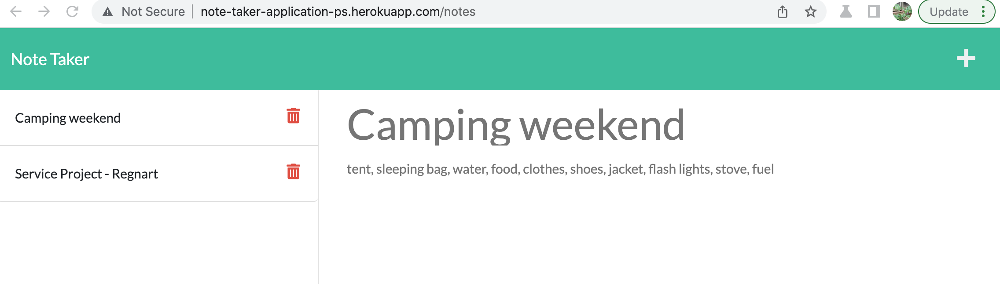

# Note-Taker-Application


## Table Of Contents
* [Description](#description)
* [Screenshots](#screenshots)
* [Installation](#installation)
* [Usage](#usage)
* [Tests](#tests)
* [Code Snippets](#code-snippets)
* [Technologies](#technologies)
* [License](#license)
* [Author Links](#author-links)
## Description
This is a full stack Notes application that allows user interaction via a frontend deployed on Heroku. The frontend allows the user to create, retrieve, view details and remove notes. The client uses the HTTP methods GET, POST and DELETE to send requests and receive responses from the server. The server uses the Express.js framework. 

The application is deployed on Heroku at: [Note-Taker-Application](http://note-taker-application-ps.herokuapp.com/).

## Screenshots
### The application [initial page](http://note-taker-application-ps.herokuapp.com/) deployed on Heroku


### Click on the Get Started button


### Create and save a note, showing the saved note.


### See details of the note 


### Delete a note (removed the "Hiking" note)


## Installation
The full stack application can be used from the [deployed URL](http://note-taker-application-ps.herokuapp.com/) without any prior installation.

If using Insomnia to interact directly with the server, express.js, and uuid are required to be installed. Please do the following in your bash:

```bash 

$ npm i
$ node server.js
```
The server listens to port 3000 for client requests (if using Insomnia).

## Usage
When using the [deployed site](http://note-taker-application-ps.herokuapp.com/) from Heroku:
1. Click on the "Get Started" button to view the notes page. The page displays a list of saved notes if any on the left side, and input fields on the right side to create a new note.

2. Click on any note on the left to see the details displayed on the right side.

3. Click on the '+' icon on the top right corner to create a note. Enter a title and text, and press the Save icon on the top right. The note is saved, and appears on the list of notes on the left.

3. Click on the trash can icon next to the note on the left to remove that item. The note should disappear.


## Tests
Insomnia can be used to test the server by sending GET, POST, and DELETE methods.

1. Initial screen:\
GET: http://localhost:3000

2. Showing the saved notes (HTML)\
GET: http://localhost:3000/notes

3. Save a note\
POST: http://localhost:3000/api/notes\
Choose Form to enter "title" and "text" parameters for the note

4. Get the saved notes\
GET: http://localhost:3000/api/notes\
Server returns the saved notes

5. Delete a saved note\
DELETE: http://localhost:3000/api/notes/:id\
(enter the id of any note from the ones returned in response to the GET request in #4)


## Code Snippets
#### NOTE: This is only pseudo code.

#### 1. Server save a note to the database on POST request from the client. 

```
app.post('/api/notes', (req, res) => {

  /* read the saved notes from the database */
  
  /* if file read is ok, parse the notes into an array */

  /* create a new Note object with a unique id */

  /* add to notes array */

  /* save all the notes back to the db */
  /* and return the new note to the client with the id */
  
  /* return the new note with the generated id */
}
     
```

#### 2. Server deletes a note from the database given the note's id.

```
app.delete('/api/notes/:id', (req, res) => {

  /* get the id of the note to be deleted from the request */

  /* read the saved notes from the database into notesArray */

  /* Iterate through the array and find the note with this id. */
  /* Delete that note from the array. */
  
  /* write all the notes back to the database */
 
  /* return the response  to client */
}

```

## Technologies
- Javascript
- express.js framework
- fs and uuid modules
- Insomnia
- Heroku

## References
- [Insomnia](https://insomnia.rest/)
- [Heroku](https://www.heroku.com)

## License
This application is covered under the [MIT License](https://opensource.org/licenses/MIT).

## Author Links
[GitHub](https://github.com/sbhikshe)\
[LinkedIn](https://www.linkedin.com/in/sripriya-bhikshesvaran-8520992/)
